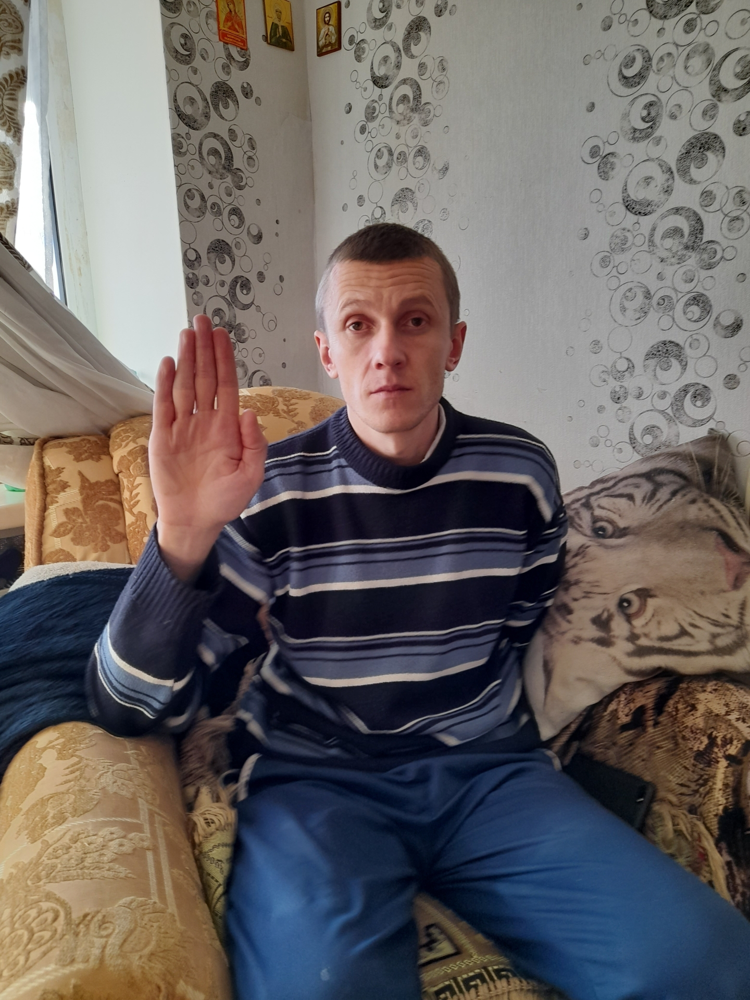
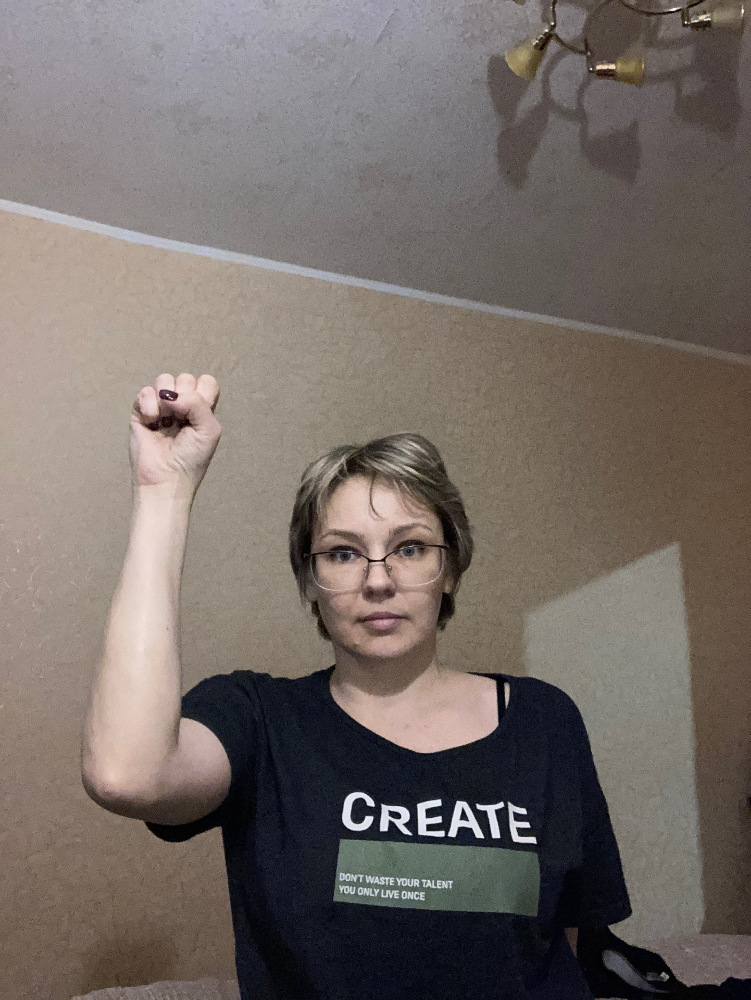
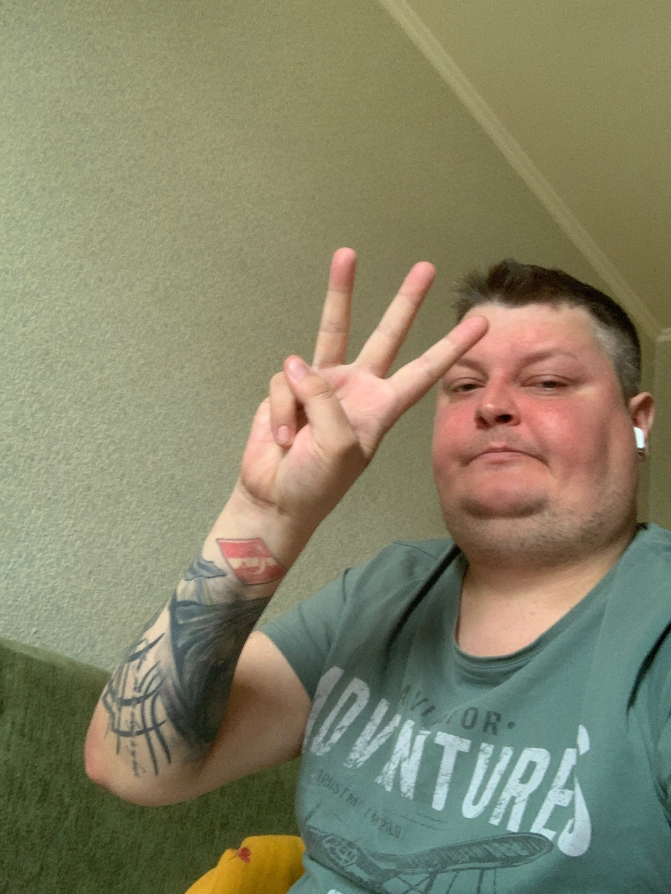
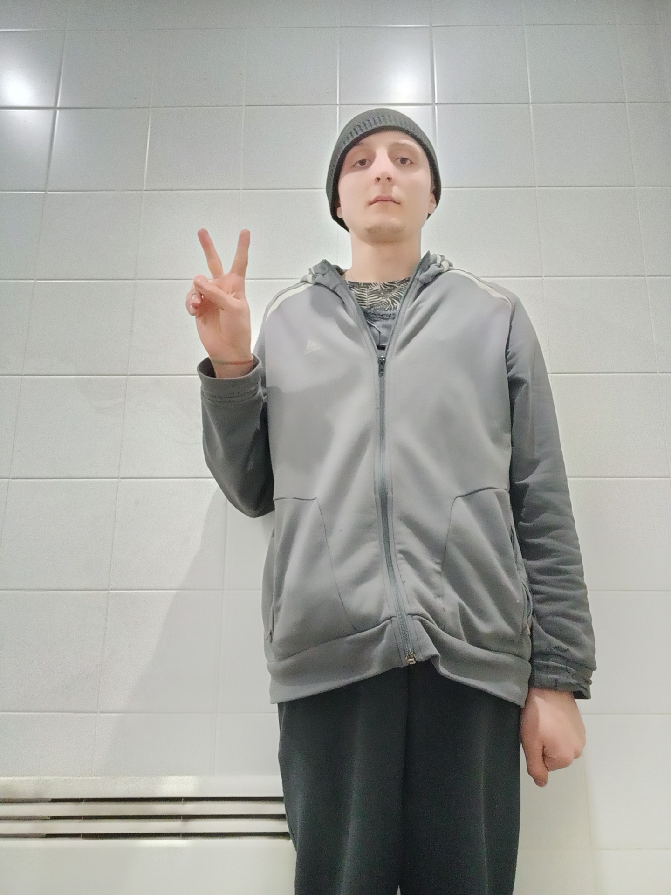
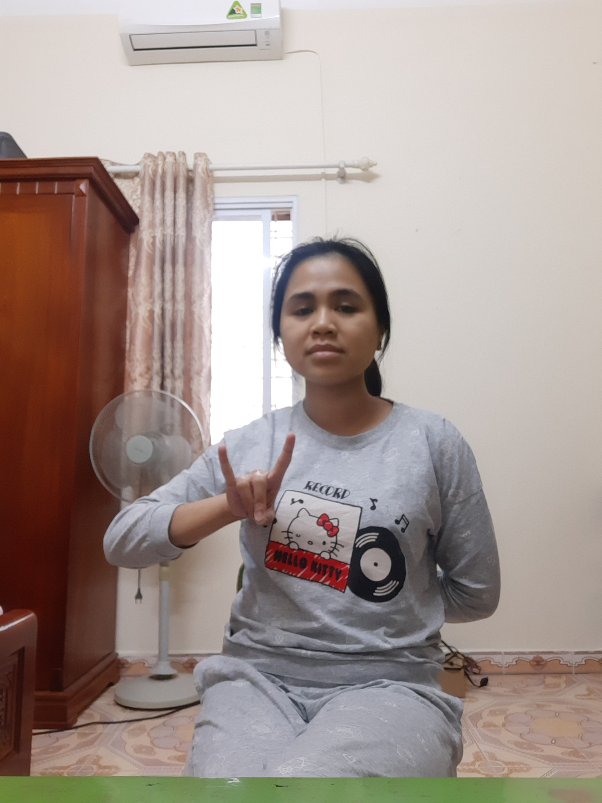
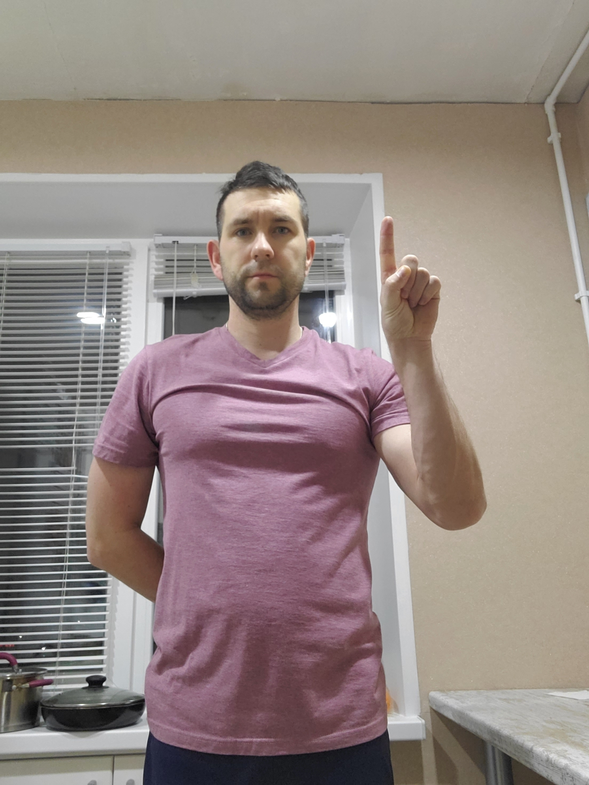
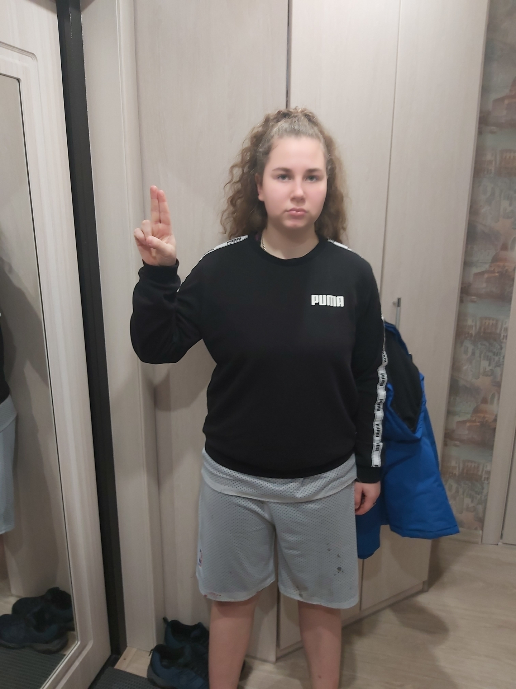

[](https://classroom.github.com/a/BOO70ufO)

# Setup

**Required**  

1. Clone the repo
2. `cd` into the **root** directory
3. Setup and activate a virtual env **(Python 3.12)**
4. `pip install -r requirements.txt`

> 💡 `requirements.txt` includes `jupyter` and `ipykernel` so the virtual environment can also be used as a kernel for the notebooks in task 1 & 2

**Optional**  
*Models and Notebooks are precompiled. These steps are only needed if you want to compile anything yourself*  

5. Download the `gesture_dataset_sample` from [rhsslk3.ur.de](https://rhsslk3.ur.de/~sca04209/gesture_dataset_sample.zip)
6. Unpack the downloaded archive into the **root** directory

> 💡 The folder structure with the downloaded dataset should look like this
```
assignment-05-cnn-realdegrees-1/
├── 01-exploring_hyperparameters/
├── 02-dataset/
├── 03-media_control/
└── gesture_dataset_sample/
    ├── _annotations/
    ├── dislike/
    ├── fist/
    └── .../
```

# Exploring Hyperparameters (number of convolution layers)

> 💡 You should be able to simply open and read the notebook without running these steps

*Optional*
1. Complete the setup steps
2. Select the virtual environment as the kernel for the notebook
3. Run all cells

# Gathering a Dataset 

> 💡 You should be able to simply open and read the notebook without running these steps

*Optional*
1. Complete the setup steps
2. Select the virtual environment as the kernel for the notebook
3. Run all cells

# Gesture-based Media Controls

This application can be used for media controls using your webcam feed to detect gestures that are mapped to media controls.  
To run it, perform the setup steps above and then run the code below.  

```sh
cd 03-media_control
python media_control.py --video-id 0 -w 640 -h 480
```

The `-w` and `-h` parameters determine the size of your webcam. They default to `640x480` and can be set to the rough resolution of your webcam to improve visuals.  
The webcam resolution has no impact on the classification performance of the program.  

This program launches a preview of your webcam highlighting the bounding box of the first hand that comes into view.  
The image is then cropped to the bounding box, preprocessed and fed into a CNN to determine the gesture.  
If a gesture is consistenly detected for a certain amount of frames an action is performed.
An internal cooldown system on top of the detection time threshold prevents unintended inputs.  
Based on the type of gesture a media action is performed using `pynput`.  

## Controls

Press `q` to close the application when the window is focused **or** use `Ctrl + C` to interrupt the python process. All other controls are handled by computervision.  

*Actions can be remapped by editing the dictionary `GESTURE_ACTIONS` in [media_control.py](./03-media_control/media_control.py) (Delete old saved model and encoder to retrain)*

### Playback
_________
| **Gesture** | **stop** | **fist** | **three** | **peace** |
|-------------|----------|----------|-----------|-----------|
| **Action**  | Stop Media Playback | Pause/Play Media | Previous Track | Next Track |
| **Example** |  |  |  |  |

### Volume
__________
| **Gesture** | **rock** | **one** | **two_up** |
|-------------|----------|---------|------------|
| **Action**  | Mute Volume | Volume Down | Volume Up |
| **Example** |  |  |  |  


*Images sourced from training dataset*

Performed actions, cooldown and additional relevant info is displayed in the application window.

> 💡 Hand bounding box detection and gesture recognition works quite well in darker conditions (as long as the contrast between hand and background is not too low) but it is *highly* recommended to be in a bright environment

> ⚠️ The model is precompiled, included in the repo and used by the application by default instead of training a new model.  
Delete [gesture_model.keras](./03-media_control/gesture_model.keras) and [label_encoder.pkl](./03-media_control/label_encoder.pkl) before launching to train and save a new model

**Known Issues**  
- There are some tensorflow and mediapipe warning logs that I was unable to get rid of without a bunch of unnecessary guards and environment variable overrides so I just kept them there, they can be ignored.
- Program startup takes a while due to model loading, once the cv2 window opens the program is fully ready  
- Windows media buttons do not support "starting" after media is "stopped", this means you will lose media control after doing the "stop" gesture until you manually start playback again. Using the "fist" gesture for pausing/resuming instead works much better. (This is not a limitation of the application but a design decision of the operating system)